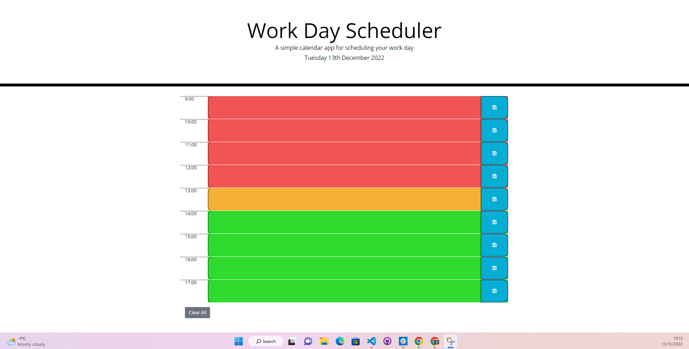

# work-day-scheduler

## Description

### The Task

I was tasked with creating a simple calendar application that allows a user to save events for each hour of the day by modifying starter code. This app will run in the browser and feature dynamically updated HTML and CSS powered by jQuery. 

In the end I have minimal code which dynamically updates the html as I could not get everything to work and I still don't understand some of the fundamental coding principles in js/jQuery, so I have hard coded the time blocks into the html. As I progress my knowledge this code will get updated and cleaned up to make it more dynamic, but I wanted to get a working application out instead of a broken one.

## The requirements

The app should:

* Display the current day at the top of the calender when a user opens the planner.
 
* Present timeblocks for standard business hours when the user scrolls down.
 
* Color-code each timeblock based on past, present, and future when the timeblock is viewed.
 
* Allow a user to enter an event when they click a timeblock

* Save the event in local storage when the save button is clicked in that timeblock.

* Persist events between refreshes of a page

## Usage

To access the website, navigate to [Work Day Scheduler](https://darrenoxley7.github.io/work-day-scheduler). Click Generate Password then follow the browser prompts.

## Installation

To view the code navigate to the website using the link above and right click on any website element and cick inspect or download the source code from [My GitHub repo](https://github.com/DarrenOxley7/work-day-scheduler.git) and open the index.html and script.js file in VS Code.

## Credits

### Resources:

MIT License

Copyright (c) 2022 DarrenOxley7

Permission is hereby granted, free of charge, to any person obtaining a copy
of this software and associated documentation files (the "Software"), to deal
in the Software without restriction, including without limitation the rights
to use, copy, modify, merge, publish, distribute, sublicense, and/or sell
copies of the Software, and to permit persons to whom the Software is
furnished to do so, subject to the following conditions:

The above copyright notice and this permission notice shall be included in all
copies or substantial portions of the Software.

THE SOFTWARE IS PROVIDED "AS IS", WITHOUT WARRANTY OF ANY KIND, EXPRESS OR
IMPLIED, INCLUDING BUT NOT LIMITED TO THE WARRANTIES OF MERCHANTABILITY,
FITNESS FOR A PARTICULAR PURPOSE AND NONINFRINGEMENT. IN NO EVENT SHALL THE
AUTHORS OR COPYRIGHT HOLDERS BE LIABLE FOR ANY CLAIM, DAMAGES OR OTHER
LIABILITY, WHETHER IN AN ACTION OF CONTRACT, TORT OR OTHERWISE, ARISING FROM,
OUT OF OR IN CONNECTION WITH THE SOFTWARE OR THE USE OR OTHER DEALINGS IN THE
SOFTWARE.